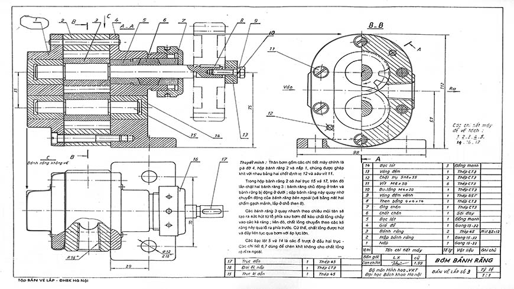
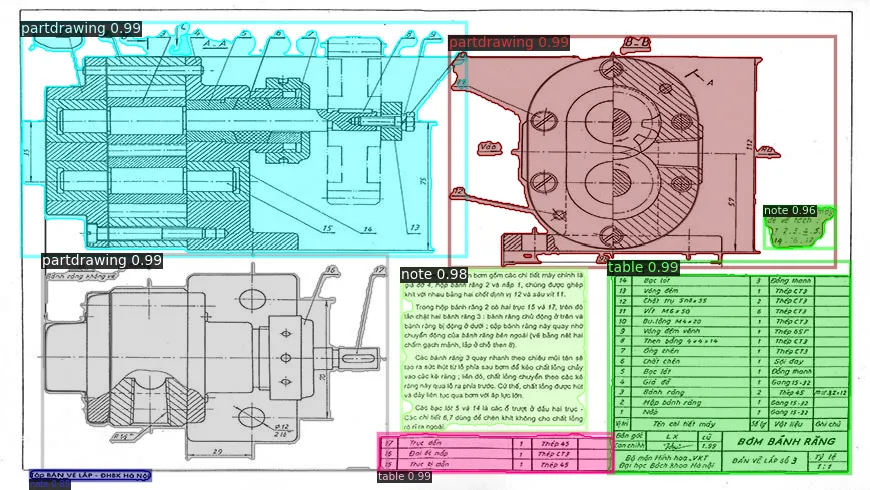
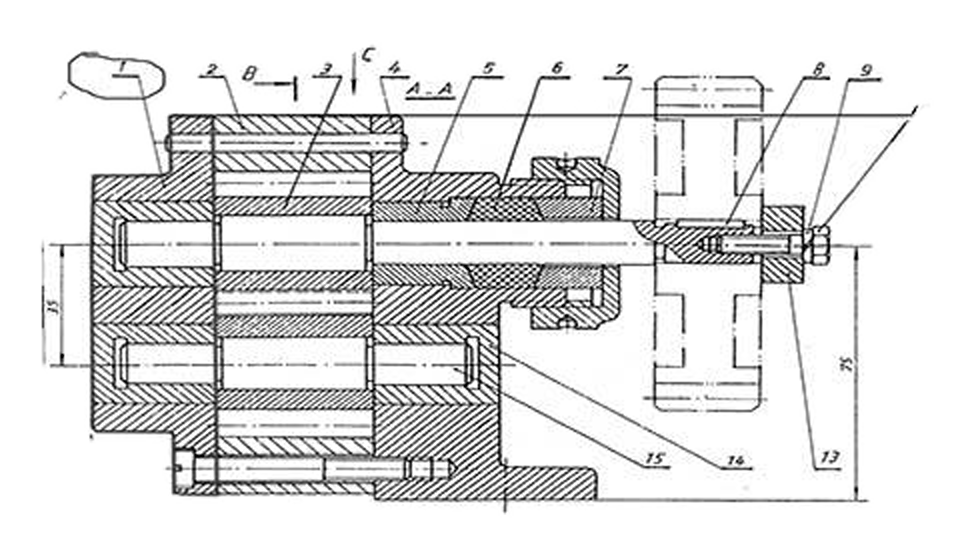
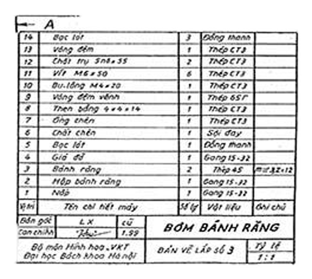
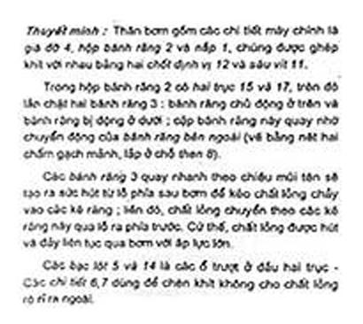
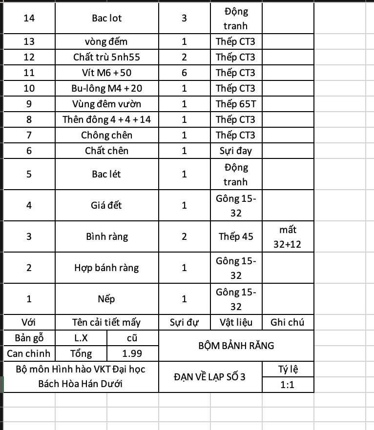
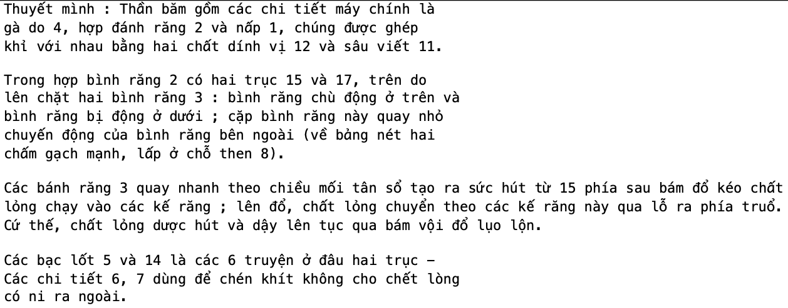
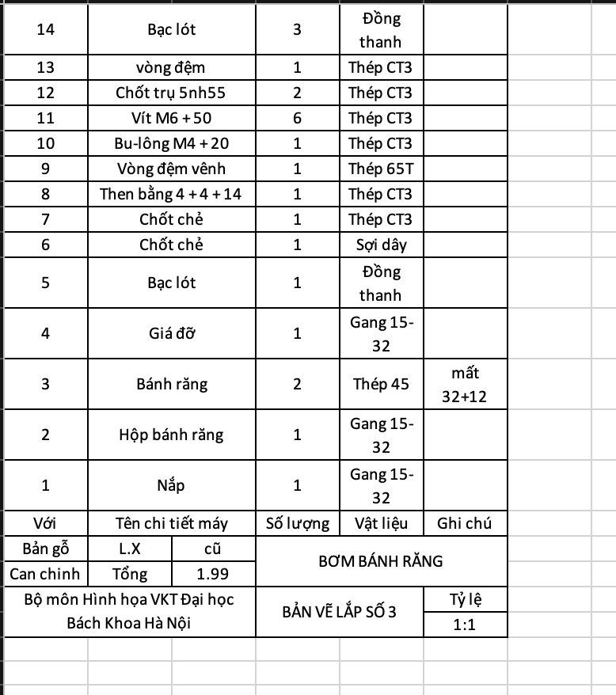
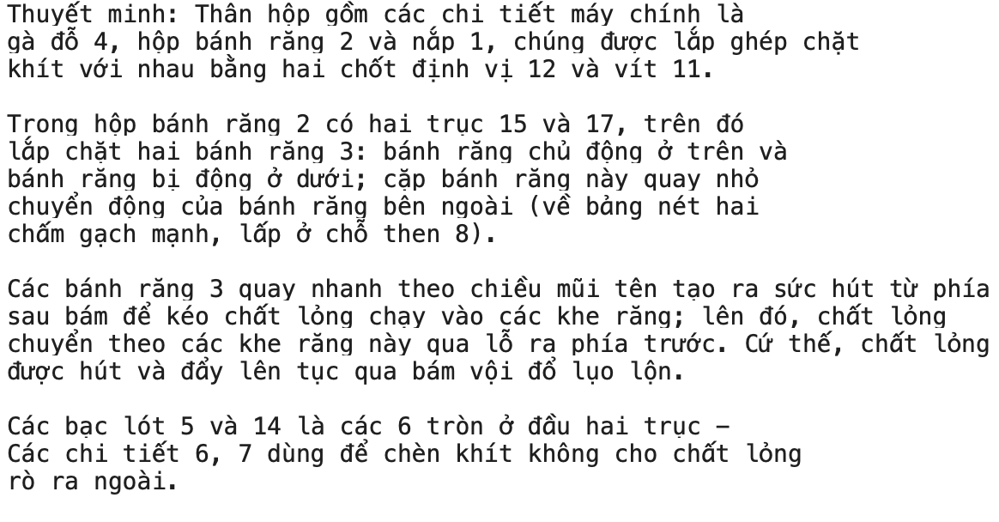

# ENGINEER DRAWING

## About

**Engineer Drawing** is a computer vision project for detecting objects in engineering drawings such as:

- Notes
- Tables
- Part drawings

The project uses **instance segmentation** to identify objects by generating masks and converting them into bounding boxes. This approach helps accurately crop objects even when multiple objects overlap.

After object cropping, OCR is applied to extract content:

- **Table images** → HTML format
- **Note images** → Plain text

[App demo](https://huggingface.co/spaces/macroni2002/engineer_drawing)

---

## Pipeline

```text
Input Image
    │
    ▼
Instance Segmentation
(mask → bbox)
    │
    ▼
Object Cropping
(handle overlap objects)
    │
    ├── Table OCR → Raw HTML ──> RAG + VLM Processing → HTML 
    └── Note OCR → Raw Text ──> RAG + VLM Processing → Text
```

---
## Example
<div align="center">
<table>
  <tr>
    <td align="center" width="18%">
      <br/>
      <b>Original</b><br/>
      <br/>
      <b>Bbox + Mask</b><br/>
    </td>
    <td align="center" width="18%">
      <br/>
      <br/>
      <br/>
      <b>Cropped Object</b><br/>
    </td>
    <td align="center" width="18%">
      <br/>
      <br/>
      <b>Table OCR</b><br/>
    <td align="center" width="18%">
      <br/>
      <br/>
      <b>Note OCR</b><br/>
    </td>
    <td align="center" width="18%">
      <br/>
      <br/>
      <b>VLM-Processed Table</b><br/>
    </td>
    <td align="center" width="18%">
      <br/>
      <br/>
      <b>VLM-Processed Note</b><br/>
    </td>
  </tr>
</table>
</div>


---

## Configuration
```bash
git clone https://github.com/macroni1407/engineer_drawing.git
cd engineer_drawing
```

### Create Conda Environment

```bash
conda create -n eng_draw python=3.10
conda activate eng_draw
```

---

### Create .env file

```bash
touch .env
```

### Create Upstash Redis token
- Go https://upstash.com/ to create a database redis
- Then fill url, token to .env
  eg:

  ```bash
  UPSTASH_REDIS_REST_URL="https://bursting-hookworm-124192.upstash.io"
  UPSTASH_REDIS_REST_TOKEN="gQAAAA****************************ZjZjA1Yw"
  ```
---

## Installation

### Step 1: Install Deep Learning Frameworks

#### Use CPU

```bash
pip install --no-cache-dir torch torchvision \
--index-url https://download.pytorch.org/whl/cpu

pip install paddlepaddle==3.2.0 \
-i https://www.paddlepaddle.org.cn/packages/stable/cpu/
```

#### Use GPU

```bash
pip install torch torchvision

pip install paddlepaddle-gpu==3.2.0 \
-i https://www.paddlepaddle.org.cn/packages/stable/cu118/
```

---

### Step 2: Install Project Dependencies

```bash
pip install -r requirements.txt

pip install --no-build-isolation \
'git+https://github.com/facebookresearch/detectron2.git'

python -m pip install "paddleocr[all]"
```

---

### Step 3: Clone Required Repositories

```bash
git clone https://github.com/facebookresearch/detectron2.git

git clone https://github.com/facebookresearch/Mask2Former.git

git clone https://github.com/PaddlePaddle/PaddleOCR.git
```

Install PaddleOCR dependencies:

```bash
pip install -r PaddleOCR/requirements.txt
```

---

## Run Project

```bash
python run.py
```
---
---

The application can also be run using Docker.

### Run with Docker

NOTE: In Dockerfile: 
- Just  un-comment if using GPU and comment for CPU               
- Add ENV for Redis    (Maybe future using aws S3 to store)
  
```bash
ENV UPSTASH_REDIS_REST_URL="https://bursting-hookworm-124192.upstash.io"
ENV UPSTASH_REDIS_REST_TOKEN="gQAAAA****************************ZjZjA1Yw"
```
  

Build Docker image:

```bash
docker build -t engineer_drawing .
```

Run container:

```bash
docker run -it -p 7860:7860 engineer_drawing
```

<!-- <!-- > Remove `--gpus all` if running on CPU only. -->

---

## Technologies Used

- PyTorch
- Detectron2
- Mask2Former
- PaddleOCR
- Qwen3-VL (notebook - post-processing for html, text)

## Resources

### Dataset

You can download the dataset from Hugging Face:

- Dataset (Hugging Face):  

  [Download here](https://huggingface.co/datasets/macroni2002/bom_dataset/tree/main)

### Model Weights

Pretrained model weights (Mask2Former - backbone Swin-Transformer) are available at:

- Hugging Face:  

  [Download here](https://huggingface.co/macroni2002/engineer_drawing_mask2former_weights/tree/main)

- Google Drive:  

  [Download here](https://drive.google.com/drive/u/0/folders/1uuIRprBsPj0UD7H8jlIu2bFQNcYCUK1l)

### Model Training
- Notebook:  

  [Mask2Former](./notebooks/mask2fomer_training_inference.ipynb)

- GG Colab:  

  [Mask2Former](https://colab.research.google.com/drive/1IJ3b8yaNj3-zTX1RInX5k8sjnR444XzS?pli=1#scrollTo=7raGqTmjTP0k)

### VLM Processing HTML & TEXT (RAG + VLM)
- Notebook:  

  [VLM Processing](./notebooks/VLM_Processing.ipynb)

- GG Colab:  

  [VLM Processing](https://colab.research.google.com/drive/1qReIHNA-ePog9Ow3kyzmVJXa6VKgCeQz#scrollTo=NsowSrrbcEEV)

